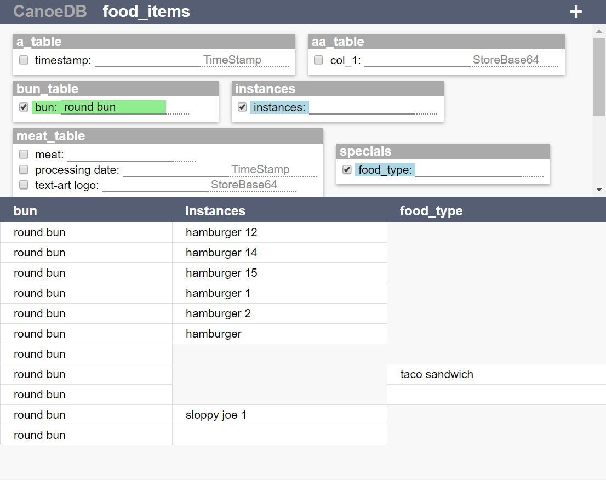

# CanoeDB
Java database that converts a directory of .CSV files into a database.

- Relational: each CSV file becomes a table with relationships to other tables
- Auto-dereferencing: references between tables are dereferenced automatically
- Simple ID: left column of table is always the reference ID column
- Simple configuration.  First 3 rows include:
	- Column names
	- References to other tables
	- Class apply a transformation to any data read or written in a column (dynamically loaded)

	
## Why Another Database?
The motivation behind this project stems from two things:
	1) Need for a good project to learn Java on my own
	2) Frustration with SQL syntax in joining random combinations of related tables
		- At my previous employer, I ended up writing a Perl microservice to automatically generate the back-end SQL for MySQL.*

Further design considerations were influenced by multiple factors:
	1) I love JSON, but it's hard for a tree-like data structure to describe overly intertwined (tangled?) data -- it's not impossible, just complex. But the same data would probably be more easily described using related tables (relational database).  Unfortunately, SQL syntax makes automatically dereference random joins between large numbers of tables very painful.
	2) Exporting data into CSV is probaly the simplest way to move raw data from another database into MySQL, but is laborious and error prone.  Then, to backup data in MySQL, enormous SQL files are generated.  The question in my mind has been: why not just leave the data in CSV format?
	3) Appending data is typically a very robust operation, and is much more reliable than overwriting.  While there inumerable fancy ways in existance to preserve data (e.g. redudnacy, journaling, "redo" records, etc.), if you can simply limit your disk transactions to APPEND operations, then you already have a very reliable system that can indefinitely survive hard resets (if it's on top of a decent file system, such as ext4).  At most, one line of data could be currupted per hard reset.
	4) CSV is likely the simplest data format acheivable, and has the unique advantage that its data can be expanded using only APPEND operations.  On top of that, it's almost universally readable by spreadsheet software, enabling alternate means of editing the database (in the famous words of Larry Wall, `There's More Than One Way To Do It` -- TMTOWTDI).
	5) "ACID" is easier to attain when you don't have to juggle data in and out of memory.  And in this 64bit world, memory address space is no longer the bottleneck it once was (maybe one day it will become that again), so and an entirely in-memory database is no only feasable, but is likely desirable.  Assuming the ammount of RAM you can afford to buy is proportional to the size of your organization and to the size of your data set, then an entirely in-memory database makes sense.
Taking each of these issues into account, the concept of CanoeDB was a *really easy* **relational NoSQL** *in-memory* database that preserves data in CSV files.

## HTTP API

## Architecture

## Class descriptions

## SPA Interface

https://gabrielwilson3.github.io/
